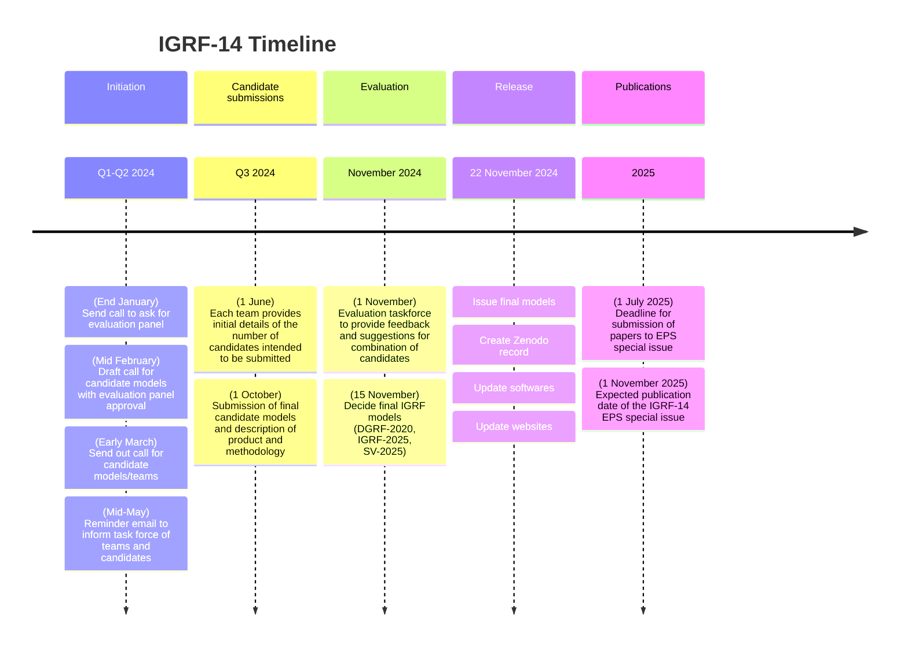

# IAGA V-MOD

This is the home of the working group for geomagnetic field modelling (WG V-MOD) for the [International Association of Geomagnetism and Aeronomy (IAGA)](https://iaga-aiga.org/about/). The main responsibility of V-MOD is the creation of the International Geomagnetic Reference Field (IGRF).

See also:
- https://www.ncei.noaa.gov/services/world-data-system/v-mod-working-group

## IGRF

See also:
- https://www.ncei.noaa.gov/products/international-geomagnetic-reference-field

## IGRF-14

The 14th IGRF is due to be released on 15th November 2024. Candidate models have been submitted for assessment at https://github.com/IAGA-VMOD/IGRF14eval

### Release process

1. The final coefficients will be determined and stored in https://github.com/IAGA-VMOD/IGRF14eval
2. The coefficients will be provided in standard formats (`.txt, .dat, .cof, .shc`) and published as a Zenodo archive with `doi:10.5281/zenodo.14012302` [(link to record)](https://doi.org/10.5281/zenodo.14012302)
3. ["Official" IGRF page](https://www.ncei.noaa.gov/products/international-geomagnetic-reference-field) will be updated accordingly
4. Update software:
  - NOAA update `Geomag 7.0`
  - BGS update Fortran code
  - TBD Python packages
  - ...
5. Update online calculators:
  - [NCEI](https://www.ngdc.noaa.gov/geomag/calculators/magcalc.shtml?useFullSite=true)
  - [BGS](https://geomag.bgs.ac.uk/data_service/models_compass/igrf_calc.html)
  - [CCMC](https://ccmc.gsfc.nasa.gov/models/IGRF~13/)
  - ...
6. Notify communities via mailing lists
